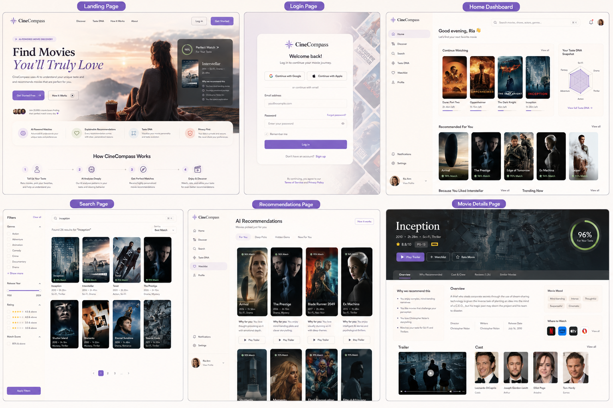

# CineCompass Frontend Design 
## Purpose
This document is the single source of truth for the CineCompass frontend.
Follow these guidelines unless explicitly instructed otherwise.
Priority order:
1. Product Vision
2. Brand Identity
3. Design System
4. UX Architecture
5. Component Library
6. Page Specifications
If there is any conflict, follow the higher priority section.

Framework
- React 19
- Vite

Language
- JavaScript 

Styling
- Tailwind CSS
- shadcn/ui

State Management
- Redux Toolkit

Routing
- React Router DOM

API
- Axios

Icons
- Lucide React

Animations
- Framer Motion

Forms
- React Hook Form

Validation
- Zod

Charts
- Recharts

Authentication
- JWT
- Google OAuth

Theme
- Light & Dark

📁 Complete Frontend Structure

cinecompass-frontend/
│
├── public/
│   ├── favicon.ico
│   ├── logo.svg
│   ├── robots.txt
│   ├── manifest.json
│   └── images/
│
├── src/
│
│   ├── assets/
│   ├── components/
│   ├── pages/
│   ├── redux/
│   ├── routes/
│   ├── services/
│   ├── hooks/
│   ├── context/
│   ├── config/
│   ├── lib/
│   ├── utils/
│   ├── styles/
│
│   ├── App.jsx
│   └── main.jsx
│
├── .env
├── .gitignore
├── README.md
├── package.json
├── vite.config.js
└── tailwind.config.js

📂 What goes inside src/

1. 📁 assets/

Static resources.

assets/
│
├── images/
├── icons/
├── fonts/
├── logos/
├── animations/
└── illustrations/

2. 📁 components/

Reusable UI only.

Never put complete pages here.

components/
│
├── ui/
├── common/
├── layout/
├── movie/
├── recommendation/
├── review/
├── search/
├── watchlist/
└── profile/

A. 📂 components/ui/

Since you're using shadcn/ui, keep all UI primitives here.

ui/
│
├── button.jsx
├── input.jsx
├── textarea.jsx
├── badge.jsx
├── avatar.jsx
├── card.jsx
├── dialog.jsx
├── dropdown-menu.jsx
├── sheet.jsx
├── tabs.jsx
├── toast.jsx
├── tooltip.jsx
├── separator.jsx
├── switch.jsx
├── skeleton.jsx
├── alert-dialog.jsx
└── spinner.jsx

B. 📂 components/common/

Reusable app components.

common/
│
├── Loader.jsx
├── EmptyState.jsx
├── ErrorBoundary.jsx
├── Pagination.jsx
├── InfiniteScroll.jsx
├── ThemeToggle.jsx
├── Logo.jsx
├── Breadcrumb.jsx
├── BackButton.jsx
└── ScrollToTop.jsx

C. 📂 components/layout/

layout/
│
├── Navbar.jsx
├── Sidebar.jsx
├── Footer.jsx
├── MainLayout.jsx
├── ProtectedLayout.jsx
└── AuthLayout.jsx

D. 📂 components/movie/

movie/
│
├── MovieCard.jsx
├── MovieGrid.jsx
├── MovieBanner.jsx
├── MoviePoster.jsx
├── CastCard.jsx
├── TrailerPlayer.jsx
├── GenreBadge.jsx
├── RatingStars.jsx
├── CompatibilityScore.jsx
└── MovieCarousel.jsx

E. 📂 components/recommendation/

recommendation/
│
├── RecommendationCard.jsx
├── RecommendationCarousel.jsx
├── TasteDNAChart.jsx
├── MatchReasons.jsx
├── CompatibilityMeter.jsx
└── AIRecommendationBox.jsx

F. 📂 components/review/

review/
│
├── ReviewCard.jsx
├── ReviewEditor.jsx
├── ReviewSummary.jsx
├── HelpfulVote.jsx
├── SpoilerTag.jsx
└── RatingDistribution.jsx

G. 📂 components/search/

search/
│
├── SearchBar.jsx
├── SearchFilters.jsx
├── SearchDropdown.jsx
├── SearchResultCard.jsx
└── FilterSidebar.jsx

H. 📂 components/watchlist/

watchlist/
│
├── WatchlistCard.jsx
├── WatchStatusTabs.jsx
├── WatchlistGrid.jsx
└── WatchlistActions.jsx

I. 📂 components/profile/

profile/
│
├── UserStats.jsx
├── TasteGraph.jsx
├── ActivityFeed.jsx
├── AchievementCard.jsx
├── FavoriteGenres.jsx
└── FavoriteMovies.jsx

3. 📂 pages/

Each folder represents one route.

pages/
│
├── Landing/
│
├── Home/
│
├── Discover/
│
├── MovieDetails/
│
├── Search/
│
├── Watchlist/
│
├── Recommendations/
│
├── TasteDNA/
│
├── Profile/
│
├── Login/
│
├── Register/
│
├── ForgotPassword/
│
├── Settings/
│
├── Admin/
│
└── NotFound/

4. 📂 redux/

redux/
│
├── store.js
│
├── auth/
│
├── movies/
│
├── recommendations/
│
├── reviews/
│
├── search/
│
├── watchlist/
│
├── notifications/
│
├── profile/
│
└── ui/

5. 📂 services/

API calls only.

services/
│
├── api.js
├── authService.js
├── movieService.js
├── reviewService.js
├── recommendationService.js
├── searchService.js
├── notificationService.js
└── userService.js

6. 📂 hooks/
hooks/
│
├── useAuth.js
├── useMovies.js
├── useRecommendations.js
├── useTheme.js
├── useInfiniteScroll.js
└── useDebounce.js

7. 📂 routes/
routes/
│
├── AppRoutes.jsx
├── ProtectedRoute.jsx
└── PublicRoute.jsx

8. 📂 context/
context/
│
├── ThemeContext.jsx
└── SocketContext.jsx

9. 📂 config/
config/
│
├── api.js
├── constants.js
├── routes.js
└── theme.js

10. 📂 lib/

Third-party library setup.

lib/
│
├── axios.js
├── socket.js
└── cloudinary.js

11. 📂 utils/
utils/
│
├── helpers.js
├── formatDate.js
├── calculateMatch.js
├── storage.js
└── validators.js

12. 📂 styles/
styles/
│
├── globals.css
├── variables.css
├── animations.css
└── typography.css

🏆 Final Folder Tree
frontend/
│
├── public/
│
├── src/
│   ├── assets/
│   ├── components/
│   │   ├── ui/
│   │   ├── common/
│   │   ├── layout/
│   │   ├── movie/
│   │   ├── recommendation/
│   │   ├── review/
│   │   ├── search/
│   │   ├── watchlist/
│   │   └── profile/
│   │
│   ├── pages/
│   ├── redux/
│   ├── routes/
│   ├── services/
│   ├── hooks/
│   ├── context/
│   ├── config/
│   ├── lib/
│   ├── utils/
│   ├── styles/
│   │
│   ├── App.jsx
│   └── main.jsx
│
├── public/
├── .env
├── .gitignore
├── README.md
├── package.json
└── vite.config.js

1. Brand Identity
Product Vision
CineCompass is a premium AI-powered movie discovery platform focused on personalized recommendations, not streaming. It should feel like a trusted movie curator rather than a movie database.
Design Keywords
Elegant
Cinematic
Premium
Modern
Minimal
Personalized
Calm
Intelligent
Insightful
User Experience Goals
Premium
Comfortable
Personalized
Calm
Easy to explore
No visual clutter
Product Personality
Think:
Apple
Pinterest
Premium Editorial Magazine
Luxury Coffee Shop
Not:
Netflix
IMDb
Hacker UI
Corporate Dashboard

2. Design Philosophy
Core Principles
Movies are the hero.
AI should feel invisible.
Every recommendation must have an explanation.
Minimalism over clutter.
Calm over flashy.
Consistency across all pages.
Large whitespace.
Elegant interactions.
Product Formula
Minimalism
+
Warmth
+
Cinema
+
Personalization
+
Quiet Intelligence
=
CineCompass

3. Color System
Palette Style
Soft muted palette.
Primary
💜 Lavender
Purpose:
Brand
Primary buttons
Active states
Links
Secondary
🌿 Sage Green
Purpose:
Match %
AI confidence
Success
Accent
🪸 Dusty Coral
Purpose:
Highlights
Notifications
Tags
Accent 2
🌊 Powder Blue
Purpose:
Search
Discovery
Information
Background
🪶 Warm Cream
Purpose:
Light backgrounds
Reading experience
Cards
Error
🌹 Muted Rose
Purpose:
Errors
Warnings

Color Philosophy
Soft contrast
Muted colors
No neon
No oversaturation
UI stays neutral
Posters provide most of the color

Theme
Light Mode
Warm
Cozy
Coffee shop
Magazine
Cream backgrounds
Dark Mode
Minimal luxury
Soft charcoal
Warm gray
Muted lavender highlights

4. Typography
Heading Font
Sora
Used for:
Hero titles
Section titles
Marketing
Large numbers

Body Font
Inter
Used for:
Reviews
Descriptions
Navigation
Forms
Cards
Buttons

Typography Style
Editorial Minimalism
Large hero headings
Strong hierarchy
Relaxed line height
Comfortable reading

Font Weights
Medium (500)
SemiBold (600)
Bold (700)

Writing Style
Human
Friendly
Elegant
Short
Warm
Non-technical
Instead of
AI Generated Summary
Use
Audience Summary
Instead of
Hybrid Recommendation Engine
Use
Recommended for You

5. Spacing System
Spacing Scale
4
8
12
16
24
32
40
48
64
80
96
Never use random spacing values.

Layout
Balanced whitespace
Large spacing between major sections
Medium spacing between related components
Small spacing inside components

Movie Cards
Medium spacing
Poster remains dominant
Layout:
Poster
Title
Match %
Rating
Genres

Sections
Large spacing between:
Hero
Trending
Recommendations
Taste DNA
Footer

Buttons
Comfortable touch targets

Mobile
Keep same spacing scale
Slightly reduce spacing
Never cramped

Reading Experience
Should feel like reading a premium magazine/blog.

6. Animations
Style:
Fast
Smooth
Natural
Apple-inspired
Movie Card Hover:
Lift ~4px
Soft shadow
Poster brightens slightly
Compatibility badge fades in
Recommendations:
Fade in
Search:
Instant results
No flashy animations.

7. UI Philosophy
The UI should never compete with movie posters.
Instead:
Clean layouts
Large posters
Soft gradients
Elegant typography
Calm hierarchy
Plenty of breathing room

8. Overall Feeling
When users spend five minutes in CineCompass, they should think:
"This feels premium, elegant, comfortable, and surprisingly personal. It understands my taste better than other movie platforms."
Design Constraints

- Mobile-first responsive design
- Accessibility (WCAG AA contrast)
- Use reusable components
- Follow consistent design tokens
- Use semantic colors instead of hardcoded hex values
- Use an 8px spacing system with 4px increments
- Large whitespace
- Movie posters are the primary visual focus
- No unnecessary gradients or glassmorphism
- Clean, modern, premium UI inspired by Apple, Pinterest, and editorial magazines
- Maintain consistency across all pages and components

Phase 2.4 — Layout Grid
Layout Philosophy
Create a clean, elegant, balanced, and effortless layout inspired by premium editorial websites. Maintain a consistent grid system while allowing hero sections and featured content to stand out. Prioritize readability, whitespace, and visual hierarchy over density.
Grid System
Responsive 12-column CSS Grid
Consistent gutters across all breakpoints
Uniform grid structure across all pages
All components align to the grid
Container
Max width: 1280px
Center all content horizontally
Large side margins on wide screens
Never stretch content edge-to-edge
Hero Section
Full-width cinematic backdrop
Content centered within 1280px container
Large editorial typography
Minimal content with strong visual focus
Movie Grid
Uniform responsive grid
Consistent card dimensions
Equal spacing between cards
Movie posters are the primary visual element
Movie Details Layout
Desktop
Two-column layout: Poster | Movie Information
Metadata, ratings, compatibility, and actions beside poster
Mobile
Single-column stacked layout
Poster above movie information
Comfortable spacing and full-width content
Search Layout
Desktop
Persistent left filter sidebar
Responsive movie grid
Mobile
Filters inside slide-out drawer
Full-width search results
Profile Layout
Design profile pages as a personal story rather than a dashboard. Prioritize:
Taste DNA
Favorite Movies
Viewing Journey
Achievements
Activity Timeline
Layout Style
Slightly rounded layouts
Balanced spacing
Soft visual hierarchy
Generous whitespace
Consistent alignment
Alignment Rules
Follow structured alignment using the grid
Keep components consistently aligned
Hero and featured sections may intentionally break the grid for storytelling
Maintain visual rhythm without appearing rigid
Responsive Strategy
Desktop
12-column layout
Sidebar navigation where appropriate
Multi-column grids
Tablet
Reduced columns
Larger touch targets
Preserve hierarchy
Mobile
Single-column layout
Drawer navigation
Stacked components
Maintain spacing scale
Content Hierarchy
Follow this structure on every page:
Hero / Page Header
↓
Primary Content
↓
Secondary Content
↓
Supporting Content
↓
Footer
Movie Details Page Order:
Backdrop
↓
Poster + Movie Information
↓
Compatibility Score
↓
Why Recommended
↓
Audience Summary
↓
Trailer
↓
Cast
↓
Reviews
↓
Similar Movies
↓
Footer
Design Principles
Content-first design
Consistent layouts
Responsive across all devices
Strong visual hierarchy
Generous whitespace
Story-driven navigation
User Experience Goal
The interface should feel premium, elegant, organized, intuitive, and effortless, allowing users to discover movies naturally without clutter.
Phase 2.5 — Border Radius
Border Radius Philosophy
Use soft, slightly rounded corners to create a premium, modern, calm, and elegant interface. Avoid sharp corporate edges and overly rounded playful styles. Border radius should enhance the cinematic experience without distracting from the content.
Radius Scale
Component
Radius
Small Elements (Badges, Chips)
Pill (9999px)
Buttons
8px
Input Fields & Search Bars
Pill (9999px)
Cards
12px
Movie Posters
8px
Dropdown Menus
12px
Popovers
12px
Modals & Dialogs
16px
Large Containers & Sections
16px

Component Guidelines
Buttons
Medium rounded corners
Comfortable touch targets
Premium appearance
Inputs
Fully pill-shaped
Clean and inviting
Consistent across forms and search
Movie Cards
Premium floating card appearance
Consistent 12px radius
Posters remain the visual focus
Movie Posters
Small corner radius
Preserve cinematic artwork
Avoid excessive rounding
Large Containers
Larger radius to create soft section separation
Maintain generous whitespace
Modals & Dialogs
Floating appearance
Soft rounded corners
Elevated above background
Dropdowns
Floating menus
Soft rounded corners
Clean shadows with subtle separation
Consistency Rules
Use a consistent radius scale across the application.
Similar components should share the same radius.
Radius should increase with component size.
Avoid arbitrary radius values.
Design Principles
Premium over playful
Elegant over decorative
Consistency over variety
Softness without losing structure
Movie content remains the primary visual focus
User Experience Goal
The interface should feel luxurious, modern, calm, and refined, with subtle rounded corners that contribute to a premium cinematic experience.
Phase 2.6 — Elevation & Shadows
Elevation Philosophy
Use elevation to create hierarchy, not decoration. Shadows should be soft, subtle, and natural, giving components a floating appearance without feeling heavy. Whitespace remains the primary method of separation, with shadows used only to reinforce depth.
Shadow Philosophy
Floating Elegance
Minimal shadows
Soft edges
Natural depth
Calm visual hierarchy
No heavy or dramatic effects
Elevation Levels
Level
Usage
Level 0
Page backgrounds, static sections
Level 1
Cards, buttons, navbar
Level 2
Hovered cards, dropdowns, popovers
Level 3
Modals, dialogs, toasts
Level 4
Tooltips and temporary overlays

Component Guidelines
Movie Cards
Slight floating appearance
Soft shadow
Maintain poster as the primary visual focus
Hover States
Lift slightly on hover
Increase shadow subtly
Smooth elevation transition
Buttons
Tiny shadow only
Clean, premium appearance
No dramatic floating effect
Dropdowns
Floating layer above content
Soft shadow
Clear visual separation
Modals & Dialogs
Floating card appearance
Soft, deeper shadow than cards
Focus remains on modal content
Navigation Bar
Very subtle bottom shadow
Helps distinguish navigation without drawing attention
Dark Mode
Reduce shadow intensity in dark mode.
Use softer, more diffuse shadows to maintain depth without creating harsh contrast.
Design Principles
Shadows support hierarchy, never dominate it.
Whitespace is the primary separator.
Elevation increases with component importance.
Hover effects should feel smooth and natural.
Maintain consistency across all components.
User Experience Goal
The interface should feel light, premium, modern, and effortlessly layered, with subtle elevation that enhances usability while preserving a calm cinematic aesthetic.
Phase 2.7 — Icons & Illustrations
Visual Philosophy
Create a clean, elegant, premium, cinematic, and minimal visual language. Icons and illustrations should support the interface without competing with movie posters or content.
Icon System
Icon Library
Lucide Icons
Icon Style
Outlined icons only
Consistent stroke width
Clean and minimal
Default Icon Size
20px
Scale up only for hero sections or special components
Illustration Style
Use Minimal Editorial Illustrations.
Illustrations should:
Feel elegant and calm
Use the CineCompass color palette
Avoid cartoon or playful styles
Support the interface without dominating it
Empty States
Use:
Minimal illustration
Short friendly message
Helpful action or suggestion
Examples:
No recommendations
Empty watchlist
No reviews
No search results
First-time user onboarding
AI Visual Language
AI should feel like Invisible Intelligence.
Avoid:
Robot imagery
Futuristic AI graphics
Excessive sparkles or glowing effects
AI should quietly assist users rather than becoming the visual focus.
Taste DNA Visualization
Use a combination of:
Network Graph
Organic Blob Visualization
The visualization should feel modern, interactive, and easy to understand while reflecting relationships between genres, themes, moods, actors, and directors.
Loading States
Use Skeleton Loaders instead of spinners whenever possible.
Skeletons should:
Match the final layout
Animate subtly
Reduce perceived loading time
Search Experience
For empty search results:
Show an elegant illustration
Display a helpful message
Suggest similar searches or popular movies
Guide users toward discovery
Emoji Usage
Use Lucide icons throughout the interface.
Reserve emojis only for AI-generated messages, onboarding, or empty states where they add warmth.
Never use emojis in navigation, buttons, forms, or primary UI components.
Design Principles
Icons support content; they never replace it.
Movie posters remain the primary visual element.
Maintain consistent icon size, spacing, and stroke.
Keep illustrations minimal and purposeful.
Every visual element should reinforce a premium cinematic experience.
User Experience Goal
The interface should feel luxurious, modern, elegant, and approachable, using a refined visual language that enhances usability while keeping the focus on discovering great movies.
Phase 2.8 — Motion System
Motion Philosophy
Motion should be purposeful, subtle, and fast. Every animation should guide attention, provide feedback, and improve usability without becoming a distraction. The interface should feel smooth, premium, and effortless, inspired by Apple and modern editorial products.
Motion Style
Fast & smooth
Minimal and elegant
Invisible by default
Purpose-driven
Never flashy or distracting
Component Animations
Movie Cards
Slight lift on hover
Soft shadow increase
Subtle poster brightness increase
Buttons
Ripple effect on click
Immediate visual feedback
Page Transitions
Quick fade transition
Smooth navigation between pages
Search Results
Fade in quickly after search
No abrupt appearance
Compatibility Meter
Animate value from 0 → Final Score
Smooth numerical transition
Taste DNA
Organic growth animation
Progressive visualization
Dropdowns
Fade + Scale animation
Smooth open and close
Modals & Dialogs
Fade + Scale animation
Floating appearance
Loading States
Skeleton loaders
Medium shimmer animation
Match final layout structure
Motion Timing
Default duration: 150ms
Hover animations: Fast
Loading shimmer: Medium
Easing: Ease-Out
Scrolling
Smooth native scrolling
Preserve browser performance
No unnecessary scroll animations
Accessibility
Respect system Reduced Motion preferences.
Disable or simplify non-essential animations when reduced motion is enabled.
Motion Principles
Motion communicates hierarchy and interaction.
Animations should feel natural and responsive.
Every animation must have a purpose.
Prioritize performance over visual effects.
Maintain consistent timing and easing across all components.
User Experience Goal
The interface should feel fluid, polished, responsive, and premium, with motion that enhances usability while remaining subtle and unobtrusive.
Phase 2.9 — Component Library
Component Philosophy
Build reusable, elegant, premium, and scalable components. Every component should solve one problem well, maintain visual consistency, and be reusable across the application.
Design Principles
Elegant & premium appearance
Highly customizable through props
Reusable across multiple pages
Responsive by default
Consistent behavior and styling
Accessibility-first

Component Architecture
Base UI Component
        ↓
Feature Component
        ↓
Page Component
Example:
Card
    ↓
MovieCard
    ↓
RecommendationCard
    ↓
ReviewCard
Extend base components instead of creating duplicate implementations.

Button System
Maintain a balanced set of variants.
Variants
Primary
Secondary
Outline
Ghost
Danger
Avoid creating unnecessary variants unless a clear use case exists.

Form System
All forms should use shared components for:
Inputs
Buttons
Labels
Validation
Error Messages
Helper Text
Ensure consistent behavior across authentication, reviews, profile settings, and search.

Loading States
Use loading states only where they improve user experience.
Guidelines:
Prefer Skeleton Loaders for page content.
Use button loading only during user actions.
Avoid excessive spinners or unnecessary loading animations.
Keep loading feedback subtle and purposeful.

Empty States
Use reusable empty state components where appropriate.
Include:
Minimal illustration
Friendly message
Clear call-to-action
Not every section requires an empty state if one isn't meaningful.

Error Handling
Use a shared Error component throughout the application.
Maintain consistent:
Error layout
Messaging
Recovery actions
Visual styling

Responsive Components
Every component should adapt automatically across:
Desktop
Tablet
Mobile
Avoid creating separate components for different screen sizes whenever possible.

Component Principles
Reusable before reusable-looking.
Extend base components instead of duplicating code.
Keep components modular and composable.
Maintain consistent spacing, typography, colors, and animations.
Prioritize readability and maintainability.

User Experience Goal
The component library should feel:
Reliable
Elegant
Premium
Every interaction should appear consistent, polished, and effortless regardless of where the component is used.

Phase 3.1 — Information Architecture
Product Philosophy
CineCompass is a personal movie companion that helps users discover movies they'll genuinely enjoy through personalized recommendations, explainable AI, and Taste DNA rather than relying solely on public ratings.

Primary Audience
Movie enthusiasts
Casual viewers
Film lovers
People who don't know what to watch
The platform is designed to serve a broad audience while personalizing the experience for each individual.

User Flow
Landing
      ↓
Login / Register
      ↓
Onboarding (First-time Users Only)
      ↓
Home (Personal Dashboard)
      ├── Discover
      ├── Search
      ├── Recommendations
      ├── Taste DNA
      ├── Watchlist
      ├── Profile
      ├── Movie Details
      └── Settings

Home (Personal Dashboard)
Home serves as the central hub of the application.
It should dynamically present personalized content based on the user's preferences, Taste DNA, watch history, ratings, and activity.
Possible sections include:
Continue Watching
Recommended For You
Because You Liked...
Trending Now
Recently Viewed
Your Taste DNA Snapshot
Friends' Activity (Future)
New Releases
Watchlist Progress

Core Features
Primary Features
Home
Search
Discover
Recommendations
Taste DNA
Secondary Features
Watchlist
Profile
Movie Details
Reviews
Trending
Notifications
Settings

Navigation Structure
Desktop
Primary Navigation
Home
Discover
Search
Recommendations
Taste DNA
Watchlist
Profile
Secondary Navigation
Notifications
Settings
Mobile
Bottom Navigation
Home
Discover
Search
Recommendations
Profile
Secondary pages (Taste DNA, Watchlist, Settings, Notifications) remain accessible through the Profile page or a "More" menu.

Authentication Strategy
Users can browse movies without signing in.
Authentication is required for:
Personalized Recommendations
Taste DNA
Ratings
Reviews
Watchlists
Profile
Friend Activity
Saved Preferences

Deep Linking
Users arriving from Google, social media, or shared links should open the relevant Movie Details page directly.

User Onboarding
Collect initial preferences to build the user's Taste DNA:
Favorite Movies
Favorite Genres
Favorite Actors
Favorite Directors
Preferred Moods
These preferences initialize personalized recommendations from the first session.

Feature Priority
Home
Search
Recommendations
Taste DNA
Discover
Watchlist
Profile
Movie Details

Information Architecture Principles
Home is the central hub of the experience.
Personalization comes before popularity.
Discovery is more important than browsing.
Search is always immediately accessible.
Recommendations should always be explainable.
Navigation should remain clean, intuitive, and uncluttered.

User Experience Goal
Users should feel that CineCompass understands their personal taste, presents meaningful recommendations immediately upon opening the app, and makes discovering their next favorite movie effortless.
🏗 Final Information Architecture
Landing
│
├── Login
├── Register
├── Forgot Password
│
└── Home (Dashboard)
      │
      ├── Discover
      │     └── Movie Details
      │
      ├── Search
      │     └── Movie Details
      │
      ├── Recommendations
      │     └── Movie Details
      │
      ├── Taste DNA
      │
      ├── Watchlist
      │
      ├── Profile
      │
      ├── Settings
      │
      └── Notifications
Phase 3.2 — User Journey
User Journey Philosophy
Every interaction should help users confidently choose the right movie with minimal effort. CineCompass should transform uncertainty into confidence through personalization, explainability, and intelligent recommendations.

Primary User Goal
The first success for a new user is receiving their first personalized recommendation.
The onboarding process should quickly lead users to discovering a movie that genuinely matches their preferences.

Returning User Experience
Returning users land on the Home Dashboard, where the first focus is Continue Watching, allowing them to seamlessly resume their viewing experience.

Primary User Journey
The core experience follows this journey:
Discover a Movie
Search for a Movie
Get AI Recommendations
Read Reviews
Save to Watchlist
Rate a Movie
Update Taste DNA
Every feature should support this natural progression.

Movie Decision Flow
When viewing a movie, users should evaluate it in the following order:
Compatibility Score
AI Explanation
Trailer
Description
Reviews
Ratings
Cast & Crew
Similar Movies
The Compatibility Score should become the primary decision-making element rather than public ratings.

Recommendation Journey
Every recommendation should immediately present:
Compatibility Percentage
Why It Was Recommended
Trailer
Movie Mood
Users should understand why a movie matches them before deciding to watch it.

Search Journey
When searching for a movie, present information in this order:
Movie Details
Compatibility Score
Trailer
Reviews
Streaming Availability
Similar Movies
Search should guide users toward confident decisions rather than simply returning information.

Watchlist Flow
Support both quick and organized workflows:
One-click save to Watchlist.
Optional categorization into:
Want to Watch
Watching
Completed
Favorites
This balances speed with organization.

Emotional Goals
After using CineCompass for a week, users should feel:
"CineCompass understands my taste."
"I don't waste time choosing movies anymore."
These emotions should guide every design and product decision.

Success Metric
A successful session ends with the user thinking:
"That was exactly the movie I wanted."
The objective is not simply to recommend movies but to consistently help users make satisfying viewing decisions.

User Journey Principles
Personalization before popularity.
Explain every recommendation.
Minimize decision fatigue.
Reduce unnecessary browsing.
Build trust through transparency.
Make discovering great movies effortless.
Phase 3.3 — Navigation System
Navigation Philosophy
Navigation should be intuitive, elegant, and effortless. Users should always know where they are, where they can go next, and reach any primary feature within two to three interactions. The navigation should prioritize discovery and personalization while minimizing visual clutter.

Desktop Navigation
Primary Navigation
Logo (Returns to Home Dashboard)
Discover
Search
Taste DNA
Profile
Secondary Navigation
Accessible through contextual navigation, dropdowns, or the Home Dashboard:
Recommendations
Watchlist
Notifications
Settings
Recommendations are intentionally excluded from the main navigation because the Home Dashboard already serves as the personalized recommendation hub.

Mobile Navigation
Bottom Navigation
Home
Search
Discover
Watchlist
Profile
Secondary pages are accessible through the Profile section or navigation drawer:
Taste DNA
Recommendations
Notifications
Settings

Logo Behavior
Clicking the CineCompass logo always returns the user to the Home Dashboard.
The logo acts as the universal shortcut to the application's central hub.

Home Dashboard
The Home Dashboard serves as the heart of CineCompass.
It dynamically surfaces personalized content, including:
Continue Watching
AI Recommendations
Because You Liked...
Trending Movies
New Releases
Taste DNA Snapshot
Watchlist Progress
Recently Viewed
Friend Activity (Future)
Recommendations are integrated into Home rather than occupying a permanent navigation slot, reinforcing Home as the user's personalized movie companion.

Search Experience
Search should be available in two ways:
Global search bar in the navigation
Dedicated Search page with advanced filters
Users should be able to initiate a search from anywhere within the application.

User Menu
Clicking the profile avatar opens:
Profile
Settings
Theme
Logout
This keeps account-related actions organized without cluttering the primary navigation.

Notifications
Notifications are accessed through a bell icon dropdown, enabling users to review recent activity without interrupting their current workflow.

Breadcrumbs
Breadcrumbs are intentionally omitted.
The application's navigation hierarchy should be intuitive enough that users always understand their location without additional navigation aids.

Back Navigation
Movie Details pages support both:
Browser Back navigation
Dedicated Back button
This ensures a flexible and familiar navigation experience.

Floating Action Button (FAB)
Include a contextual Floating Action Button for quick actions such as:
Surprise Me
Quick Search
Create Watchlist
The FAB should remain subtle, context-aware, and never interfere with core navigation.

Navigation Style
Navbar
Glassmorphism
Soft transparency
Subtle background blur
Elegant floating appearance
Behavior
Sticky while scrolling
Smooth transitions
Lightweight and responsive

Active Navigation
Highlight the active page using:
Soft background
Rounded corners
Gentle accent color
Avoid harsh indicators such as bold underlines.

Mobile Navigation
Secondary features are accessed through a slide-out drawer.
Examples include:
Taste DNA
Recommendations
Settings
Notifications
Help
About

Footer
Desktop footer includes:
About
Contact
Privacy Policy
Terms of Service
GitHub Repository
The footer should remain clean, minimal, and unobtrusive.

Navigation Principles
Keep primary navigation focused on core user journeys.
Use the logo as the universal shortcut to Home.
Home acts as the personalized dashboard and recommendation hub.
Avoid duplicate navigation paths.
Ensure Search is always easily accessible.
Maintain consistency across desktop and mobile.
Navigation should guide users naturally without explanation.

User Experience Goal
Users should feel that navigating CineCompass is effortless, elegant, and intuitive. Every important feature should be immediately accessible, while the Home Dashboard serves as a personalized command center that helps users confidently discover their next favorite movie.

Final Navigation Structure
Landing
│
├── Login
├── Register
├── Forgot Password
│
└── Home Dashboard
      │
      ├── AI Recommendations
      ├── Continue Watching
      ├── Because You Liked...
      ├── Trending Movies
      ├── New Releases
      ├── Taste DNA Snapshot
      ├── Watchlist Progress
      │
      ├── Discover
      │     └── Movie Details
      │
      ├── Search
      │     └── Movie Details
      │
      ├── Taste DNA
      │
      ├── Watchlist
      │
      ├── Profile
      │
      ├── Settings
      │
      └── Notifications

🏆 Final Navigation Philosophy
The navigation should feel invisible. Users shouldn't think about where to go—they should naturally flow through the experience. The Home Dashboard is the command center, surfacing personalized recommendations, recent activity, and discovery opportunities. The logo serves as the universal path back Home, while the navigation remains intentionally minimal, emphasizing Discover, Search, Taste DNA, and Profile. This keeps CineCompass focused on its core promise: helping users confidently find the perfect movie without unnecessary complexity.

